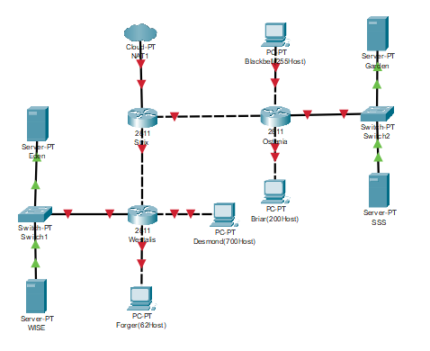

# Jarkom-Modul-5-ITA10-2022

**Laporan Resmi praktikum Jarkom kelompok ITA10**
 
Kelompok:
- Hafizh Abid Wibowo (5027201011)
- Muhammad Farrel Abdillah (50272010570)
 
Berikut adalah Dokumentasi dan langkah pengerjaan untuk laporan resmi praktikum jarkom modul 5 oleh ITA10
 

# **Soal Shift**
Setelah kalian mempelajari semua modul yang telah diberikan, Loid ingin meminta bantuan untuk terakhir kalinya kepada kalian. Dan kalian dengan senang hati mau membantu Loid.
 
 
(A) Tugas pertama kalian yaitu membuat topologi jaringan sesuai dengan rancangan yang diberikan Loid dibawah ini:
 
 
Keterangan :	Eden adalah DNS Server
 
WISE adalah DHCP Server
 
		1. Garden dan SSS adalah Web Server
     
		2. Jumlah Host pada Forger adalah 62 host
     
		3. Jumlah Host pada Desmond adalah 700 host
     
		4. Jumlah Host pada Blackbell adalah 255 host
     
		5. Jumlah Host pada Briar adalah 200 host
     
     
(B) Untuk menjaga perdamaian dunia, Loid ingin meminta kalian untuk membuat topologi tersebut menggunakan teknik CIDR atau VLSM setelah melakukan subnetting.
 
(C) Anya, putri pertama Loid, juga berpesan kepada anda agar melakukan Routing agar setiap perangkat pada jaringan tersebut dapat terhubung.
 
(D) Tugas berikutnya adalah memberikan ip pada subnet Forger, Desmond, Blackbell, dan Briar secara dinamis menggunakan bantuan DHCP server. Kemudian kalian ingat bahwa kalian harus setting DHCP Relay pada router yang menghubungkannya.
 
1. Agar topologi yang kalian buat dapat mengakses keluar, kalian diminta untuk mengkonfigurasi Strix menggunakan iptables, tetapi Loid tidak ingin menggunakan MASQUERADE.
2. Kalian diminta untuk melakukan drop semua TCP dan UDP dari luar Topologi kalian pada server yang merupakan DHCP Server demi menjaga keamanan.
3. Loid meminta kalian untuk membatasi DHCP dan DNS Server hanya boleh menerima maksimal 2 koneksi ICMP secara bersamaan menggunakan iptables, selebihnya didrop.
4. Akses menuju Web Server hanya diperbolehkan disaat jam kerja yaitu Senin sampai Jumat pada pukul 07.00 - 16.00.
5. Karena kita memiliki 2 Web Server, Loid ingin Ostania diatur sehingga setiap request dari client yang mengakses Garden dengan port 80 akan didistribusikan secara bergantian pada SSS dan Garden secara berurutan dan request dari client yang mengakses SSS dengan port 443 akan didistribusikan secara bergantian pada Garden dan SSS secara berurutan.
6. Karena Loid ingin tau paket apa saja yang di-drop, maka di setiap node server dan router ditambahkan logging paket yang di-drop dengan standard syslog level.
Loid berterima kasih pada kalian karena telah membantunya. Loid juga mengingatkan agar semua aturan iptables harus disimpan pada sistem atau paling tidak kalian menyediakan script sebagai backup.
 

# **Konfigurasi: Topologi**
Berikut ini merupakan screenshot dari topologi yang akan digunakan untuk mengerjakan soal shift praktikum.
 

 
Topologi diatas dibuat sesuai dengan keterangan pada soal shift, yaitu:
1. Eden adalah DNS Server
2. WISE adalah DHCP Server
3. Garden dan SSS adalah Web Server
4. Jumlah Host pada Forger adalah 62 host
5. Jumlah Host pada Desmond adalah 700 host
6. Jumlah Host pada Blackbell adalah 255 host
7. Jumlah Host pada Briar adalah 200 host

# **Kesulitan yang dialami**
- kesulitan dalam perhitungan IP
- hanya dapat mengerjakan soal hingga topologi saja
